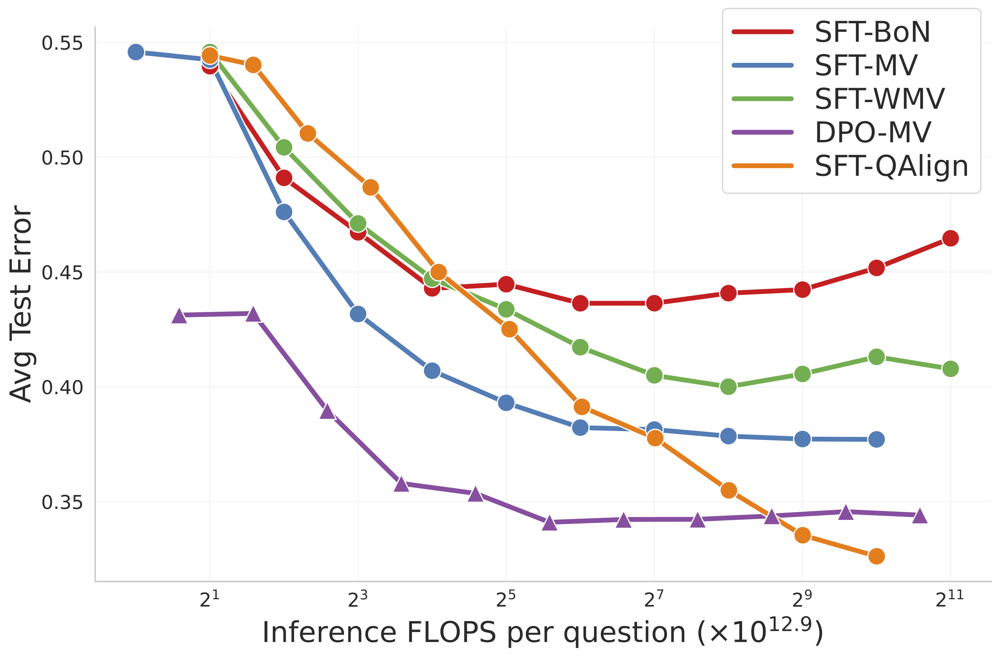

# Sample, Don't Search: Rethinking Test-Time Alignment for Language Models

Gonçalo Faria, Noah A. Smith

**Paper**: https://arxiv.org/abs/2504.03790

**TL;DR:** QAlign is a new test-time alignment approach that improves language model performance by using Markov chain Monte Carlo methods.

### Abstract:
Increasing test-time computation has emerged as a promising direction for improving language model performance, particularly in scenarios where model finetuning is impractical or impossible due to computational constraints or private model weights. However, existing test-time search methods using a reward model (RM) often degrade in quality as compute scales, due to the over-optimization of what are inherently imperfect reward proxies. We introduce QAlign, a new test-time alignment approach. As we scale test-time compute, QAlign converges to sampling from the optimal aligned distribution for each individual prompt. By adopting recent advances in Markov chain Monte Carlo for text generation, our method enables better-aligned outputs without modifying the underlying model or even requiring logit access. We demonstrate the effectiveness of QAlign on mathematical reasoning benchmarks (GSM8K and GSM-Symbolic) using a task-specific RM, showing consistent improvements over existing test-time compute methods like best-of-n and majority voting. Furthermore, when applied with more realistic RMs trained on the Tulu 3 preference dataset, QAlign outperforms direct preference optimization (DPO), best-of-n, majority voting, and weighted majority voting on a diverse range of datasets (GSM8K, MATH500, IFEval, MMLU-Redux, and TruthfulQA). A practical solution to aligning language models at test time using additional computation without degradation, our approach expands the limits of the capability that can be obtained from off-the-shelf language models without further training.
<!-- toc -->



<p align="center"><em>Average error rate across multiple evaluation datasets (GSM8K, MATH500, MMLU-Redux, TruthfulQA, and IFEval) as a function of the floating point operations (FLOPS) in log scale.
      We compare <strong style="color: #ff7f00;">QAlign method with <span style="font-variant: small-caps;">Tülu3-8B-SFT</span></strong> against four baselines: <strong style="color: #984ea3;"> majority vote (MV) <span style="font-variant: small-caps;">Tülu3-8B-DPO</span></strong>, and applied to <span style="font-variant: small-caps;">Tülu3-8B-SFT</span> the methods <strong style="color: #e41a1c;"> best-of-<i>n</i> (BoN)</strong>, <strong style="color: #377eb8;"> MV</strong>, and <strong style="color: #4daf4a;"> weighted MV (WMV)</strong>. All experiments use temperature 1.0 with reasoning included in model outputs. Note that <span style="font-variant: small-caps;">Tülu3-8B-DPO</span> model is the result of doing preference finetuning on the <span style="font-variant: small-caps;">Tülu3-8B-SFT</span> with 271k preference pairs. The costs associated with this process are not accounted for in this plot.</em></p>


-----
## <div align="center">Dependencies</div>

This project was based on the following external libraries:
- [deepspin/quest-decoding](https://github.com/deep-spin/quest-decoding)

For saving experiment data we use the expkit-core package. 
```bash
pip install expkit-core # required only for the experiment 
```

Install the required packages:
```bash
pip install -r requirements.txt
```

-----
## <div align="center">Reproducing the work</div>

Replicating the work: 

### Experiment Setup
1. **Create Configuration Files**
   ```bash
   # Create configs for general experiments
   scripts/create_all_general_experiments.sh
   
   # Create configs for task-specific experiments
   scripts/create_all_task_experiments.sh
   ```

### Running Experiments
2. **Execute Experiments**
   ```bash
   # Run experiments locally
   scripts/run_local_experiments.sh
   
   # Run experiments on remote server
   scripts/run_remote_experiments.sh
   ```

### Evaluation & Analysis
3. **Evaluate Results**
   ```bash
   # Compare responses against ground truth answers
   scripts/run_eval_experiment.sh
   
   # Evaluate reward model for ancestral predictions (remote by default)
   scripts/run_rm_eval.sh
   ```

4. **Generate Final Predictions**
   ```bash
   # Run WMV, BON, and MV final prediction methods
   scripts/run_pred.sh
   ```


-----

## <div align="center">Quick Start</div>

This guide will help you get started running QAlign.

## Basic Usage

To quickly try out QAlign, you'll need two servers running compatible language models:  
- A **generation model** (for sampling text responses)  
- A **reward model** (for evaluating responses)

You can use [vllm](https://github.com/vllm-project/vllm) for both, or swap in `sglang` as appropriate.
Below are *example commands* (adjust model paths and ports as needed):

**1. Start the Reward Model Server (on port 8001):**
```bash
vllm serve Skywork/Skywork-Reward-Llama-3.1-8B-v0.2 --task classify --port 8001
```

**2. Start the Generation Model Server (on port 8000):**
```bash
vllm serve meta-llama/Llama-3.1-8B-Instruct  --port 8000
```

Once the servers are running, you can use the following Python script to sample and align responses via QAlign:

```python
from qalign.reward import RemoteReward
from qalign.model import RemoteVLLM
from qalign.base import QAlign

# Define your generation model (connected to localhost:8000)
model = RemoteVLLM(
    server_url="http://localhost:8000",
    model_path="meta-llama/Llama-3.1-8B-Instruct",
    max_prompt_length=100,
    max_new_tokens=50,
)

# Define the remote reward model (connected to localhost:8001)
reward = RemoteReward(
    server_url="http://localhost:8001",
    model_path="Skywork/Skywork-Reward-Llama-3.1-8B-v0.2",
    server_format="vllm",
)

# Set up the QAlign chain
chain = QAlign(
    model=model,
    reward=reward,
    beta=1.0, 
)

# Example conversation/question
question = (
    "Joana has 10 apples. She gives it to The Lord of Fire which multiplies them by 2 every 10 seconds. "
    "One in five of the apples are poisoned and will kill anyone who eats them. "
    "All of the apples will be eaten by a hungry crowd. How many people die after 50 seconds?"
)

# Run QAlign for 8 steps
results = chain.run(
    conversations=[
        [{"role": "user", "content": question}]
    ],
    steps=8,
    use_tqdm=True,
)

# results.state_path contains stepwise generations without-accept/reject filtering
```

**Tips:**
- You can point `server_url` to a remote server, e.g., `"http://remotehost:8001"`, as long as your reward/generation servers are accessible.
- `max_prompt_length` and `max_new_tokens` can be tuned based on your hardware/needs.
- For other supported server formats or reward models, see the documentation.


-----

## <div align="center">Contact</div>

For bugs and feature requests please visit [GitHub Issues](https://github.com/goncalorafaria/qalign/issues). For business inquiries or
professional support requests please send an [e-mail](mailto:goncalofaria.research@gmail.com).

-----

## <div align="center">Citation</div>

````
@misc{faria2025sampledontsearchrethinking,
      title={Sample, Don't Search: Rethinking Test-Time Alignment for Language Models}, 
      author={Gonçalo Faria and Noah A. Smith},
      year={2025},
      eprint={2504.03790},
      archivePrefix={arXiv},
      primaryClass={cs.CL},
      url={https://arxiv.org/abs/2504.03790}, 
}
````

